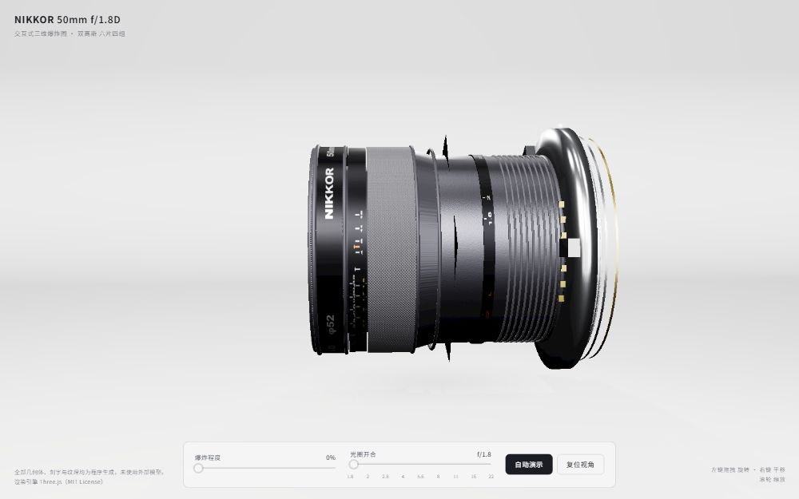
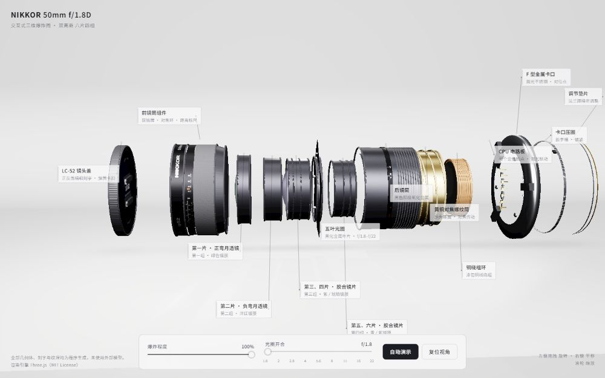
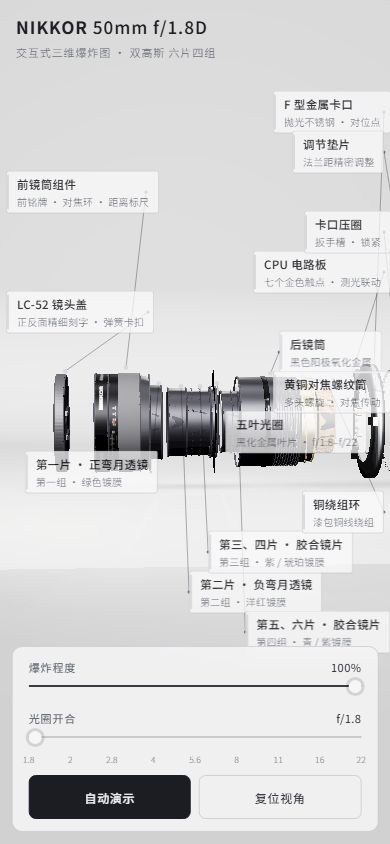

# NIKKOR 50mm f/1.8D · 交互式三维爆炸图

一个完全在浏览器中运行的交互式三维爆炸图，以专业产品摄影棚呈现尼康 **NIKKOR 50mm f/1.8D** 镜头的完整机械与光学结构。全部几何体、刻字与纹理均由 Three.js **程序化生成**，未使用任何外部模型或贴图素材；Three.js 运行时随仓库提供，打开即用、无需联网。

## 特性

- **14 个零件沿光轴错峰拆分**：LC-52 镜头盖（正反面精细刻字、弹簧卡扣）、前铭牌 / 前镜筒 / 对焦环一体组件、双高斯六片四组镜片、五叶光圈、后镜筒、黄铜对焦螺纹筒、铜绕组环、带七个金色触点的绿色电路板、F 型金属卡口、卡口压圈与调节垫片
- **真实玻璃光学表现**：`transmission` 透射、IOR 1.52，六片镜片各具曲率，带有绿、洋红、紫、琥珀、青色的薄膜干涉镀膜反射与暗色边圈
- **可辨认的材质细节**：黑色阳极氧化细颗粒、菱形橡胶滚花、镜筒轴向拉丝、抛光不锈钢、黄铜、漆包铜绕组，以及带细密加工纹理的黑化光圈叶片
- **完整刻字与标尺**：前铭牌铭文、从 ∞ 到 0.45 m 的对焦距离标尺、英尺副标尺、成对景深刻线、橙色红外标记，以及 f/1.8–f/22 光圈刻度环
- **交互控制**：独立的爆炸程度与光圈开合滑杆、平滑拆装且光圈同步开合的自动演示，以及随拆解渐显、自动避让的细引线标签
- **专业产品摄影棚**：无缝弧形背景布（cyclorama）、左前柔光箱主光、右前补光、正后窄角轮廓光、RoomEnvironment IBL、柔和接触阴影与 ACES Filmic 色调映射
- 桌面与移动端响应式适配

## 截图

全爆炸态：零件沿光轴依次展开，引线标签标注每个部件。

移动端：窄屏下镜头完整入画，标签全部避让至控制坞上方。

## 使用

直接用现代浏览器打开 `nikkor-50mm-exploded.html` 即可，无需构建、无需网络。

- 左键拖拽：旋转视角
- 右键拖拽：平移
- 滚轮：缩放
- 底部滑杆：控制爆炸程度与光圈开合；「自动演示」播放完整拆装流程

> 转发或部署时，请将 `nikkor-50mm-exploded.html` 与 `assets/` 目录一起保留。

## 技术栈

- [Three.js](https://threejs.org/) r147（MIT License），本地 `assets/` 运行
- OrbitControls、RectAreaLight、PMREM RoomEnvironment、MeshPhysicalMaterial（透射 / 薄膜干涉）、EffectComposer / UnrealBloomPass
- 原生 HTML / CSS / JavaScript，单文件交付，无构建步骤

## 许可

本项目代码以 [MIT License](LICENSE) 发布。渲染引擎 Three.js 同样采用 MIT License。本项目为非官方的学习与展示作品，与 Nikon 公司无关。
